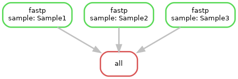

# Module 
Joshua L. Major-Mincer  
Last Updated: 03/24/2025

## Run Command
```
snakemake --cores 12
```
## Description
Covers the essentials of snakemake and how to make a minimally-functioning pipeline. 

## Workflow


## Concepts
### Command Line
To run a Snakemake workflow, you minimally need to use the command line `snakemake --cores X`, where `X` is the amount of CPU cores that are provided to Snakemake. In this example, we are providing 12 CPU cores.  
The amount of cores dictates the amount of jobs that are able to run in parallel. Rules, by default, use 1 thread (cores) to run, and so in our case, 12 rules may be run simultaneously. See the `README.md` of `Module3-WorkflowDecorators` for more information on how threads and cores dictates Snakemake parallelism. 

### Snakefile
Each snakemake pipeline needs a `Snakefile`. This is where all of the commands pertaining to the workflow will be held.  
Snakemake is written in Python, and as such, `Snakefile`s can contain the Snakemake-specific code (such as `rules`) as well as Python code before the pipeline to "set the scene". For example, in this first `Snakefile`, notice that we still have a few import statements and we define a list of `samples`. 

By default, Snakemake automatically looks for and detects a `Snakefile` file in the directory which Snakemake is run in. However, you can specify a specific Snakefile to run using `snakemake --snakefile ...`. See `Module6-CondaOrModules` for an example on how this works. 

### Rules
Each process in a Snakemake workflow is known as a `rule`. `rule`s are the building blocks of a Snakemake workflow and should be relatively granular; each rule should serve a singular purpose, and these rules should be added or removed as needed to accomplish the overall task of the workflow.  
Each `rule`, at a minimum, needs a few fields: 
* `input`: this is the file or directory paths that are operated on in the rule. In our example rule `rule fastp`, we have two inputs, `r1` equaling the path of the read 1 file, and `r2` of the read 2 file. You might notice the notation `{sample}`, these are known as `wildcards`: for more information, see the `Wildcards` section. 
* `output`: Like `input`, these are the paths to the files or directory paths of the expected output produced by the rule. 
* code: the last needed block is a block of some code that produces the expected `output` files. These code blocks can be a variety of options: `shell` for bash shell commands, `script` for Python, R, or bash scripts, or `run` for Python code. `shell` will be used the most for this tutorial as it is the most straight-forward to implement. The `input` and `output` variables can be referenced in the `shell` block itself using curly braces. For example, the first line:  
```fastp --in1 {input.r1} --in2 {input.r2}```  
will evaluate to   
```fastp --in1 ../data/{sample}_R1.fastq --in2 ../data/{sample}_R2.fastq```

In Snakemake, rules can be dependent on one another; the output of one rule may be used as the input of another file. These strings of inputs and outputs are followed, and Snakemake determines what is needed to be run to produce the desired output.  
**A workflow is considered "done" when the input of the final dependent rule is satisfied. In Snakemake, it is common to have a final `rule all` that defines the final desired output of the total workflow**.  
In this small example, the rules of our `Snakefile` are executed until all input files of this final `rule all` are satisfied; so if we are missing, for example, `output/data/Sample1_R1.clean.fastq`, then the workflow will trace back to the rule that produces this output, `rule fastp`, and execute this rule. 

### Wildcards
If we have many input files that we want to perform the same actions on, it would be unreasonable to hard-code each of these paths and manually run the workflow on these files every time. The Snakemake solution to this is to define `wildcards`, which are denoted by the curly braces `{ }` in the `input` and `output` variable paths. In our workflow, the only `wildcard` is `{sample}`. This `wildcard` will be substituted with our desired sample values, and this is usually defined using the `expand` function. See the next section for details. 

### Expand
The `expand` function essentially states: "Stop the workflow, fill in the 'wildcard blanks' with these values, make sure all of the desired input is available, and then proceed". Let's break down our example in `rule all`:  
`expand("output/data/{sample}_R1.clean.fastq", sample=samples)`  

In the `expand` function, we're defining `sample=samples`. This `sample` is referring to the same `{sample}` `wildcard` defined in the path `"output/data/{sample}_R1.clean.fastq`. Recall that `samples` is our list `["Sample1", "Sample2", "Sample3"]`. 

To put this in English, this command means:  **Stop the pipeline and do not proceed until `output/data/Sample1_R1.clean.fastq`, `output/data/Sample2_R1.clean.fastq`, and `output/data/Sample3_R1.clean.fastq` exists!**  

As these files do not exist at the start of the workflow execution, the values for the wildcards are individually propogated back to `rule fastp`, and the rule is executed to satisfy this request. See the **Workflow** section to see an illustration of how this works; the `rule fastp` is executed three times, each with `{sample}` `wildcard` defined as one of the values in the `samples` list.  

### Wildcard Combinations in Expand
There is no example in the current Snakefile, but a characteristic of `expand` is that, when multiple wildcards are defined, it will `expand` the possible combinations of the defined wildcards. Let's take an example:  
`expand("data/{sample}_{read}.fastq", sample=["Sample1", "Sample2"], read=["R1", "R2"])`  

**This will "expand" the wildcards to satisfy all of the possible combinations in this list:** 
* `data/Sample1_R1.fastq`
* `data/Sample1_R2.fastq`
* `data/Sample2_R1.fastq`
* `data/Sample2_R2.fastq`

However, a useful feature of `expand` is that you can define a function to specify how the wildcards are expanded. In this case, let's try the `zip` function:  
`expand("data/{sample}_{read}.fastq", zip, sample=["Sample1", "Sample2"], read=["R1", "R2"])`  

Given two equal length lists, `zip` will pair the item at each index with the item at the same index in another list. And so, our expansion becomes: 
* `data/Sample1_R1.fastq`
* `data/Sample2_R2.fastq`