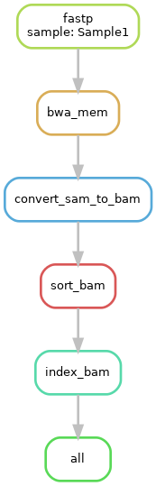

# Module 
Joshua L. Major-Mincer  
Last Updated: 08/09/23

## Run Command
```
snakemake --cores 12
```
## Description
Introduces chaining of multiple rules, temporary output, and wildcard constraints in a workflow that preprocesses fastq reads, aligns them to a reference genome, and compresses the output.  
For illustrating the concept of rule chaining, a few new rules are introduced: 
* `bwa_mem`: Aligns the cleaned reads of the sample to the defined reference genome: in this case, we're only using chromosomes 1-3. 
* `convert_sam_to_bam`: The output of `bwa mem` is a `.sam` file, so this rule converts it to a `.bam` file. 
* `sort_bam`: Uses `samtools` to sort the `.bam` file.
* `index_bam`: Indexes the `.bam` file. 

## Workflow


## Concepts
### Rule Chaining
Rules can be chained together automatically based on the `input` and `output` defined in each rule. That is, if a rule's `input` is the same as another rule's `output`, the first rule is inferred to be dependent on the successful execution of the other rule. In this case, the execution of `rule convert_sam_to_bam` is dependent on `rule bwa_mem`, which is dependent on `rule fastp`. **Ensure that rules needing to be chained together have outputs and inputs that match!**  

Importantly, the only values needing to be defined in `rule all` are files which are the "end products" of the pipeline. As the final desired product is `output/data/{sample}-sorted.bai`, the other `output` of all of the rules will be created naturally in the process of creating this final output.  

Additionally, **the presence of intermediate files will prevent the re-execution of previously executed rules!** For instance, if the pipeline was run, and the cleaned fastp files were created, but the execution was halted before `rule bwa mem` was complete, then upon re-execution, **`rule fastp` would not re-execute due to the output being present already**. This feature is useful for long workflows with time-intensive steps. 

### Temporary Output
You may not want to retain all of the intermediate output that is created during the execution of a workflow. In this case, take `.../{sample}-aligned.bam` and `.../{sample}-aligned.sam` as an example. `.sam` and `.bam` files are easily converted to one another, and `.sam` files typically take up much more space due to being uncompressed text files. So we may wish to get rid of the `.sam` file once we have our `.bam` file. The output of `rule convert_sam_to_bam` is also marked as temporary because the following rule, `rule sort_bam`, outputs the sorted bam file.  

In Snakemake, you can define an output as temporary using the `temp()` function. After the rules dependent on these temporary files are done executing, Snakemake will remove them as they are no longer needed. In our workflow, `rule bwa_mem` makes use of this function, check it out!  

### Wildcard Constraints
Wildcards are regular expressions that expand greedily to satisfy the conditions set forth by the expression. Let's take a look at these chaining inputs/outputs: 
* `rule fastp: output/data/{sample}_R1.clean.fastq`  
* `rule bwa_mem: output/data/{sample}-aligned.sam`  
* `rule convert_sam_to_bam: output/data/{sample}.bam`  

When Snakemake propogates these wildcards back through the pipeline, these wildcards are attempted to be matched **greedily**. For instance, it is unclear from `{sample}.bam` to `{sample}-aligned.sam` if the evaluation includes `-aligned` or not. For this purpose, `wildcard_constraints` are useful to specify that the wildcards should only match a specific pattern. In our pipeline, we state that the `{sample}` wilcard should only be alphanumeric. **Therefore, it is recommended that every defined wildcard is constrained by a pattern.** Try commenting out the wildcard constraints and re-running the workflow to see what happens!