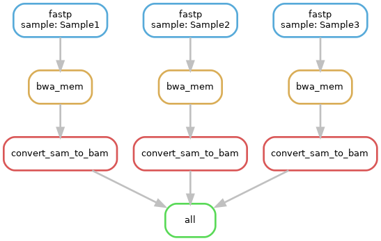

# Module 
Joshua L. Major-Mincer  
Last Updated: 08/10/23

## Run Command
```
snakemake --cores 32
```
## Description
Introduces rule decorators, which can help define the computational resources needed by Snakemake rules. 

## Workflow


## Concepts
### Threads
In Snakemake, `threads` are the number of CPU cores provided to the rule when running. Even though Snakemake can run many rules in parallel, some tools may benefit from more cores to run individual processes in parallel.  
The amount of `threads` given to a rule is directly related to the number of specified `--cores` provided to the Snakemake workflow when run from the command line. The balance of these two can determine how many rules will be able to run in parallel.  
For example, if we have our `rule fastp` which takes 4 threads, and we run our workflow with `snakemake --cores 32`, that means that 8 parallel `rule fastp` can run at a time, and the total amount of threads used by all concurrent rules will not exceed 32.  
It may be good to play around with the amount of threads provided to a rule to minimize runtime based on the efficiency of the tool using those threads. For example, it may be quicker to run 4 concurrent `rule fastp` with 8 threads each rather than 32 concurrent `rule fastp` with 1 thread each. 

### Resources
The `resources` decorator is where you can define other computational resources that a rule might need to operate. Some common resources include: 
* `tmpdir`: the temporary directory where temporary output is stored for this rule. Normally, Snakemake uses the `$TMPDIR` environment variable, but you can define specific temporary directories using this resource. 
* `runtime`: This resource indicates the maximum time allowed for a rule to run. This resource can be good when submitting jobs to a workload manager system such as SLURM. 
* `disk` and `mem`: These define the amount of disk space and RAM needed for the rule, respectively. You can either define these with suffixes such as "KB", "MB", or "GB", or you can define integers directly using the `mem_mb` or `disk_mb` resources. **These resources are good to prevent some rules from taking all available RAM from other jobs and causing OOM errors!**

### Log
If you want to log the standard error (or standard output, depending on the software) of a rule, then you can define the `log` path using this decorator. However, note that error logs are not automatically directed to these log files; you still need to redirect it yourself. Note in `rule fastp`, the standard error is redirected using `2> {log.stderr}`. 

### Params
`params` are values that are needed by the Snakemake rule that are not necessarily files. Look at `rule fastp` for an example. In our case, we want to define the average quality to filter reads on as the integer `20`. We can define the `qual = 20` variable in the `params` decorator, and access it later in the rule using a similar notation, `{params.qual}`. 