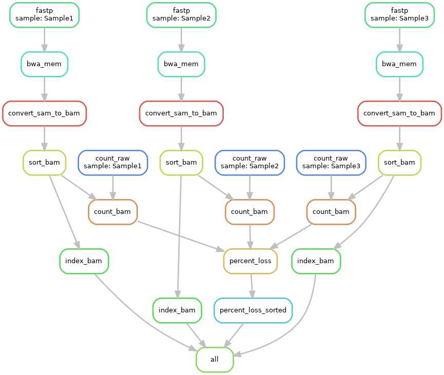

# Module 
Joshua L. Major-Mincer  
Last Updated: 08/11/23

## Run Command
```
snakemake --cores 32
```
## Description
The output of a rule in Snakemake can be used by more than 1 process at a time. In addition, the output of more than 1 rule can come together and be used in a rule. Finally, parallel paths in a Snakemake workflow, such as each path in the workflow operating on a sample at a time, can converge before the last `rule all`. 
These concepts are illustrated by calculating the amount of starting reads, the amount of reads after alignment, calculating percent loss, and determining the sample in our workflow that has the most percent loss after pipeline execution.  
This setup leads to a pretty complicated DAG, **so the branching paths will not be replicated for the later modules.**

## Workflow


## Concepts
### One Input, One Sample, Multiple Rules
Our first example of a branching path is the rules `rule fastp` and `rule count_raw`. In this new rule, we're taking the raw `fastq` files and counting the number of reads that are found within.  
This illustrates that **the same input file from the same sample can be passed to multiple rules at the same time without conflict**. Each of these rules will produce their own unique output, and these outputs are used by different rules.  

### Many Inputs, One Sample, One Rule
The second example is centered around `rule count_bam`. In this rule, the amount of remaining reads for a sample after filtering, mapping, and sorting are calculated. As we want to compare this final number to the starting number of raw reads, we will also take our output from `rule count_raw` and append the count of final reads to this file.  
This illustrates an example in which **different paths for the same sample can converge, and output files from different rules for the same sample are used in a single process for a single goal**.  

### Many Inputs, Many Samples, One Rule
As Snakemake normally operates, the wildcards are used to define independent paths of processing. However, recall that `expand` function says **Stop the pipeline and do not proceed until these inputs exist!** Usually, we can use this function in our `rule all` to decide that the pipeline ends when the specified output files for all of the `{sample}` wildcards exist. However, we can **specify `expand()` in an earlier rule to aggregate intermediate files from all `{sample}` wilcard samples and perform a single operation on all of them!**  

In our `rule percent_loss`, the output of every `rule count_bam` call is used as input. When we call `expand()` in this context, the result is a list of files matching all of the expanded wildcards. In this specific example, our `{input.count_files}` becomes: 
```
count_files = [
    "output/counts/Sample1-counts.txt", 
    "output/counts/Sample2-counts.txt",
    "output/counts/Sample3-counts.txt"
]
``` 

Note that in the `shell` command, we are able to reference this list of files and iterate through them using a bash `for loop`. This rule takes the raw and final read counts of all of the sample count files, calculates the percent loss (I think I did that right), and appends it to the single `{output.percent_loss}` file. Note that this rule's `output` serves as the `input` for `rule percent_loss_sorted`.  
When aggregating input across resolved wildcards such as this, it is important to remember that **`rule percent_loss` will not activate until all samples have gone through `rule count_bam`, so these rules may serve as a bottleneck**. 