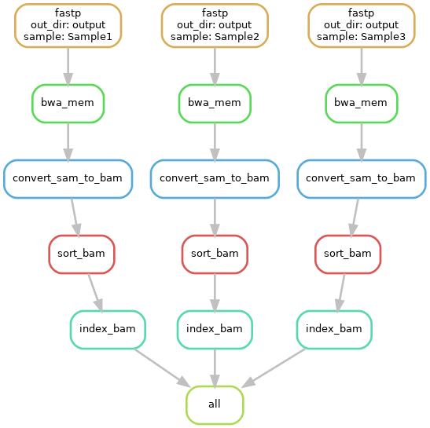

# Module 
Joshua L. Major-Mincer  
Last Updated: 08/11/23

## Run Command
```
snakemake --cores 32
#OR
snakemake --cores 32 --configfile=config.yaml
```
## Description
Snakemake workflows are best developed with reproducibility and transportability in mind. Up until this point, however, the execution of the workflow has been dependent on input data living in the `../data/` directory and output being pushed to the `output/...` directories. If you wanted to reuse this workflow, if may be possible to manually change every path for the specific use case. However, this can become tedious, especially if there are many people that want to use the workflow.  
The best option for reproducibility and transportability is a `config.yaml`, which is a `.yaml` file that can be intaken by Snakemake and be used to define any sort of variable that you would want to for the execution of the workflow.  
In this module, we cover the concept of the configuration file, with minor topics like the `--configfile` command line argument, combinatorial `wilcard` expansions, and code before Snakemake. 

## Workflow


## Concepts
### Configuration Files
Configuration files are `.yaml` files that Snakemake recognizes and reads in. By default, Snakemake looks for config files following the naming convention `config.yaml`, but you can also manually define a specific configuration file to use using the `--configfile=file.yaml` nomenclature.  
A `.yaml` file is, in essence for Snakemake, a file of `KEY: VALUE` pairs. Common data structures in this file include:  
* A key and a value: 
    ```
    KEY: VALUE
    ```
* A key and a list of values: 
    ```
    KEY: 
        - VALUE1
        - VALUE2
        - VALUE3
    ```
* A nested dictionary: 
    ```
    KEY1: 
        KEY2_1: VALUEX
        KEY2_1: VALUEY
    ```

In our example, we have a `config.yaml` file with the following items defined: 
* `input_directory: "../data"`
    * Input directory for our reads of samples. 
* `output_directory: "output"`
    * Output root directory for where all output of the workflow run will be found. 
* `reference_genome: ../reference/chr1-3.fa"`
    * Reference genome that we will align our samples to. 
* `samples: [Sample1, Sample2, Sample3]`
    * Names of samples that we'll look in `input_directory` for. 

As you can imagine, this configuration makes our workflow extensible to a greater variety of use cases. The most obvious here is that we can change the `input_directory` to define a different set of samples to run the pipeline on. However, you can also run the same workflow on the same samples multiple times, but using different reference genomes each time by changing the `reference_genome` key. We could also change the set of `samples` to run this on in case we want to run on more or less. **Notably, we can save multiple copies of configuration files as different named files and re-run by taking advantage of the `--configfile=file.yaml` command line option!**  

In order to load this information into the Snakemake file, use the special line of code: 
```
configfile: 'config.yaml'
```

`configfile` is a reserved keyword in Snakemake, and this line of code will read the contents of `config.yaml` into a dictionary named `config`. In the subsequent lines of code, we can access the values of this dictionary using the same named keys as in the `config.yaml`. For example, we're taking the `config["input_directory"]` and saving it to a local Python variable named `in_dir`. 

### Python Code in Snakefile
This example serves as a good segue to using general Python code in Snakemake.  
When Snakemake executes, the workflow itself only starts once the interpreter "reaches" a `rule`. This means that we can specify chunks of Python code to get our environment ready to run the defined rules.  
For example, we use Python to strip any trailing `/` from the ends of `in_dir` and `out_dir`, which will ensure that we have proper pathing in the `input` and `output` of each Snakemake rule. If we do not do this, then there is the risk that the `input` for `rule all` will expand to:  
`output//data/Sample1-sorted.bai`  

**It is good practice to include Python code before the Snakemake workflow to check the configuration file parameters and ensure that they follow proper naming conventions or are the right data types before passing into the Snakemake workflow!**

### Combinatorial Expansion 
This Snakemake workflow shows an example of combinatorial expansion of wildcards. For more detail on how this works, see `Module1-Basics/README.md -> Wildcard Combinations in Expand`. 