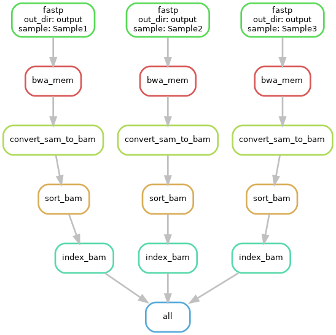

# Module 
Joshua L. Major-Mincer  
Last Updated: 03/24/2025

## Run Command
```
# For conda...
snakemake --cores 32 --sdm conda --snakefile Snakefile_Conda

# For modules...
snakemake --cores 32 --sdm env-modules --snakefile Snakefile_Modules
```
## Description
When running Snakemake rules, you'll usually need some kind of installed software. Generally, Snakemake will look for the software that is loaded into your own environment, but a better practice is to explicitly define the software that is required by each rule. To do this, there are two main options: 
* Defining a conda environment with the software needed. 
* Defining modules present on a High Performance Computing environment. 

This module will cover both of these approaches, and each of these can be tested using the different Snakefiles.  
**For the proceeding modules, we will be using the conda approach, since this is more portable**. 

## Workflow


## Concepts
### Conda Environments
To specify a conda environment which a rule should use, use the `conda: "path/to/environment.yaml"` workflow decorator. To see an example, see `rule fastp`.  
When defining this `conda` decorator, you'll point to a path to a `.yaml` configuration file that defines: 
* `name`: the name of the conda environment. 
* `channels`: the channels to download the software from. 
* `dependencies`: a list of the packages that are needed in the environment. It is also good practice to **include the version of the software required by the rule**.  

In our `envs/bioinformatics.yaml` file, we require the `bwa`, `fastp`, `fastqc`, and `samtools` software to operate.  

Additionally, if you have a pre-existing conda environment that you would like to use, and you are running Snakemake with an active `conda` instance, then you can refer to the environment by name if it already exists. For example, `conda: "env_name"`. **Note that this method is less portable.**

When running a Snakemake workflow using the conda directive, you need to include the `--sdm conda` command line argument to specify that you wish to use conda. Upon running the pipeline, if the environment does not already exist, Snakemake will go through and download the required software into a conda environment stored in the `.snakemake/` hidden directory. **This strategy can be particularly useful when you need separate computing environments that depend on different software versions, such as requiring two environments dependent on different versions of Python or R!**

### HPC Modules
If you instead are running your workflow on a HPC environment and wish to use the included modules, then you have to replace the `conda` directive with `envmodules` directive, specifying the module and/or version that you need for that rule. Additionally, snakemake needs to be run with `--sdm env-modules` when doing so. 