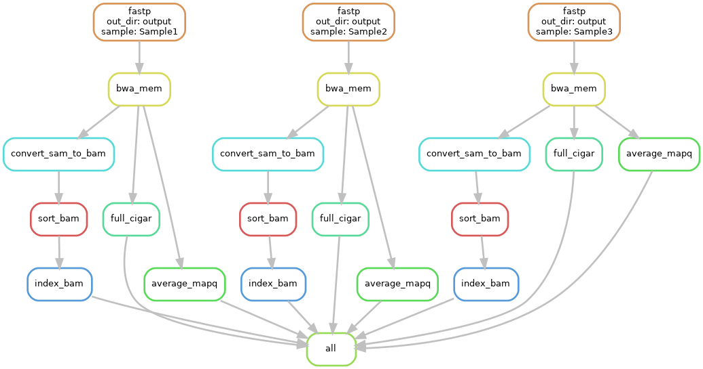

# Module 
Joshua L. Major-Mincer  
Last Updated: 03/24/2025

## Run Command
```
snakemake --cores 32 --sdm conda
```
## Description
You may need to write custom Python or R code to use in a Snakemake workflow. This module illustrates how to incorporate Python and R scripts into rules, as well as how to leverage Object Oriented Programming (OOP) nature of Python to access attributes of Snakemake objects to make the workflow more legible and customizable.  

## Workflow


## Concepts
### OOP 
Snakemake's rules are Python objects, and each field in these is an attribute. Taking `rule bwa_mem` as an example, the input `r1_clean` has been changed to: 
```
input:
    r1_clean = rules.fastp.output.r1_clean
```

Let's break down what this means. 
* `rules`: This is the Python object containing all of our Snakemake rules. 
* `rules.fastp`: We reference the attributes of the `rule fastp`. 
* `rules.fastp.output`: We reference the output variables of `rule fastp`. 
* `rules.fastp.output.r1_clean`: We grab the value of the `r1_clean` output of `rule fastp`. In this case, this would be `"{out_dir}/data/{sample}_R1.clean.fastq"`.  

So, why is this useful? As we add more and more rules, it may get complicated to keep the order and linking of rules in track. **By referencing the expected input as the output of another rule using object attributes, we avoid the need to trace the input paths and output paths and can directly see which rules are linked to which.** Instead of trying to determine which other rules use `{out_dir}/data/{sample}_R1.clean.fastq`, we can instead directly see that `rule bwa_mem` uses the output of `rule fastp`. 

Each of the fields in a rule can be access in this way. For example, `rules.fastp.input.r1`, `rules.fastp.threads`, and `rules.fastp.log.stderr` are all valid.

Additionally, we can use functions and data structures to access paths or variables based on which sample we are using for a given rule. Recall that, for each instantiation of a rule, there are a set of wildcards used, like our `sample` wildcard. Say, for instance, we want to have different average quality filtering parameters for `rule fastp` for filtering based on which sample is being used. We define a dictionary `sample_quals`, which has the desired sample quality for each sample, and a function `getSampleQual`, which intakes wildcards and returns the sample quality from our `sample_quals` dictionary. Then, if we define our `params: qual = getSampleQual`, this allows us to dynamically access sample qualities. Here's how this works:
* For each function used in any of the fields of a Snakemake rule, `wildcards` are accessible.
* We define `params: qual` as the `getSampleQual` function.
* The `wildcards` are passed to `getSampleQual`. 
* The `wildcards` will contain the current wildcard values for that rule instantiation. For example, `wildcards = {"sample": "Sample1"}`. 
* Within `getSampleQual`, the `sample_quals` dictionary is indexed for `wildcards.sample`, which, in our above bullet, is equal to `sample_quals["Sample1"]`. 
* 5 is returned by the function.
* rule `fastp` is run with `params: qual = getSampleQual`, evaluating to `params: qual = 5` when `wildcards.sample == "Sample1`. 

Defining variables using functions and data structures is also possible in other fields of Snakemake `rules`, such as `input`. For example, we could use a lambda function to alternatively define our `input` file paths. Let's say we have `sample_paths`, a `dict` where each key is a sample name, and each value is another `dict` of `READ#: path` key:value pairs. If we revisit `rule fastp`, we can see that we can access these paths using a `lambda` function and using a `wc` shorthand for `wildcards`. If our `wildcards.sample == "Sample1"`, then our input for `r1` will evaluate to:
* `input: r1 = lambda wc: sample_paths[wc.sample]["R1"]`
* `input: r1 = lambda wc: sample_paths["Sample1"]["R1"]`
* `input: r1 = in_dir + "/Sample1_R1.fastq"`

**This can be especially important if you need each sample has a different amount of input files, has input files stored in different locations, or requires different parameters per rule.**

### Python Script
A toy rule is added, `rule full_cigar`, which calls a Python script to take find the amount of mapped reads that have 100% of bases matching to the reference genome.  
In `rule full_cigar`, our `shell` block has been replaced with a `script` block, which points to a path of either a Python or an R script. In this rule, we reference `scripts/full_match_cigar.py`.  
Taking a look at this file, we can see that we are able to directly reference `snakemake` objects. With the Snakemake API, we don't directly reference the rule; rather, when the script is called from a rule, the contents and attributes of that rule are passed directly to the script. For example, with wildcard `{sample}` equal to `Sample1`, `snakemake.input.sam` is equal to `output/data/Sample1-aligned.sam`. The path for the `output` file works the same. Aside from this, the rest of the Python script is just a normal Python script; no other special considerations are required. 

### R Script
Another toy rule, `rule average_mapq`, calculates the average mapping quality of the aligned `.sam` file using an R script. Like the Python scripts, the R script functions essentially the same; the `snakemake` object is an S4 object that contains the same fields as the rule, including `snakemake@log`, `snakemake@input`, and `snakemake@avg_mapq`. **The use of these scripts are highly useful for writing custom code and keeping the base workflow legible.**

### Bash Script
We've replaced the `shell` portion of `rule covert_sam_to_bam.sh` with a `bash script` to illustrate how to access variables. Snakemake fields are associative arrays in bash, for example, `${snakemake_input[sam]} == "output/data/Sample1-aligned.sam"`. 