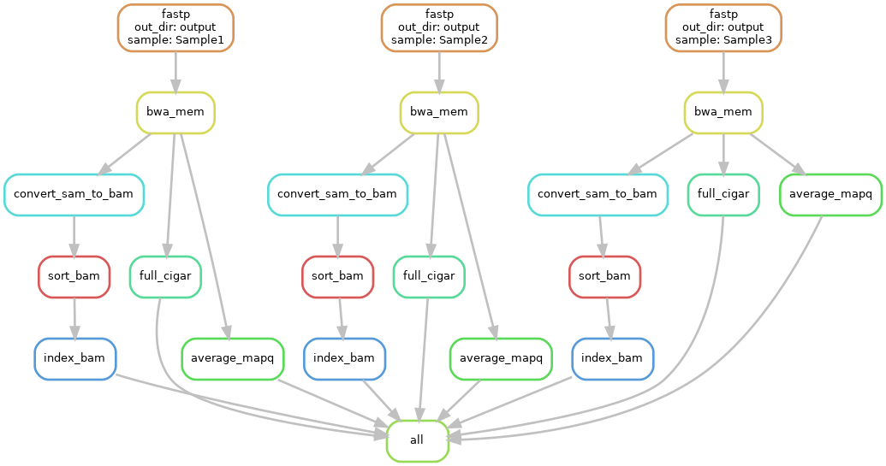

# Module 
Joshua L. Major-Mincer  
Last Updated: 03/24/2025

## Run Command
```
# Using local profile.
snakemake --profile profiles/local

# Using slurm-based profile.
snakemake --profile profiles/slurm
```

## Description
When pipelines get larger and larger, there may be more command line options you wish to customize. As these can get extensive, enumerating all command line options every run may be laborious and can hamper reproducibility. To get around this, Snakemake provides `profiles` to store command line options. Additionally, if you use a cluster-based environment, such as SLURM, you can schedule jobs using Snakemake. 

## Workflow


## Concepts
### Profiles
As your rules get longer and more complicated, you may have more and more command line options needed. To ensure that these command line options themselves are reproducible, you can put them in a `.yaml` file known as a `profile`. These `profiles` are essentially a `.yaml` dictionary of all of the command line arguments that you wish to use. When referencing a `profile`, note that you **have to point to the directory containing the config.yaml, not at the file itself. i.e. you need to specify `--profile profiles/default`, and NOT `--profile profiles/default/config.yaml`. 

In our `local` cluster, we have a few fields that are worth discussing: 
* `rerun-incomplete: true`: if rules were unfinished in the previous workflow attempt, rerun them.
* `rerun-triggers: ["mtime"]`: assume `rule A`'s output is input to `rule B`. If the output of `rule A` is newer than the output of `rule B`, then rerun `rule B` using this newer input file.
* `software-deployment-method: conda`: this is the longer flag equivalent to `--sdm`. Run rules with environment in `conda` directive if given.
* `conda-prefix: conda_envs/`: instead of creating conda environments in hidden `.snakemake` directory, create them in `conda_envs/`. 
* `retries: 1`: if a `rule` fails, retry it once. 
* `cores: 20`: number of cores to supply pipeline. 
* `resources`: this determines the total resources that a Snakemake workflow may not exceed per instantiation.
    * `threads=20`: do not exceed 20 `threads` across all running `rules`.
    * `mem_mb=50000`: do not exceed 50 GB memory across all running `rules`.
* `default-resources`: specify default resources for each `rule` if not otherwise specified in each rule.
    * `mem_mb=4000`: give each rule 4 GB memory if not define in the `rule`. 

### SLURM
When running rules with SLURM, the pipeline works as a workflow manager. It runs locally, while creating individual SLURM jobs for each rule. Each rule is then run in each independent SLURM rule. To run Snakemake with SLURM, you need the `snakemake-executor-plugin-slurm` package installed in our environment. Additionally, there are some command line arguments needed to work with SLURM, which are defined in our `profiles/slurm` profile:
* `executor: slurm`: tell Snakemake that you are running the pipeline using SLURM.
* `jobs: 20`: instead of defining `cores`, we define `jobs`. This specifies that Snakemake is not to submit more than 20 SLURM jobs at a time.
* `resources`: as with `local`, the submitted SLURM jobs are not to exceed 30 `threads` or 50 GB memory across all running jobs.
* `default-resources`: there are some new default resources needed for each rule to work with SLURM:
    * `slurm_account="account"`: equivalent to the SLURM header `#SBATCH --account=account`.
    * `slurm_partition="partition"`: equivalent to the SLURM header `#SBATCH --partition=partition`. 
    * `runtime=1440`: each rule can run for no more than 12 hours. This can be account:partition dependent. 