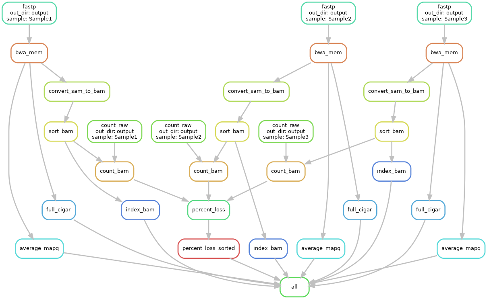

# Module 
Joshua L. Major-Mincer  
Last Updated: 03/24/2025

## Run Command
```
snakemake --profile profiles/local
```
## Description
This last module ties together all of the concepts used previously and puts them together in one large workflow; long workflow with mutiple branching paths, use workflow decorators and a `conda` environment, external Python and R scripts, and modifiable configuration files. The only introduced concept here is the use of a profile. Otherwise, **this is the complete workflow that should give you an idea of the structure of making your own Snakemake pipeline!**

## Workflow


## Concepts
### Profiles
As your rules get longer and more complicated, you may have more and more command line options needed. To ensure that these command line options themselves are reproducible, you can put them in a `.yaml` file known as a `profile`. These `profiles` are essentially a `.yaml` dictionary of all of the command line arguments that you wish to use. When referencing a `profile`, note that you **have to point to the directory containing the config.yaml, not at the file itself. i.e. you need to specify `--profile profiles/default`, and NOT `--profile profiles/default/config.yaml`. 